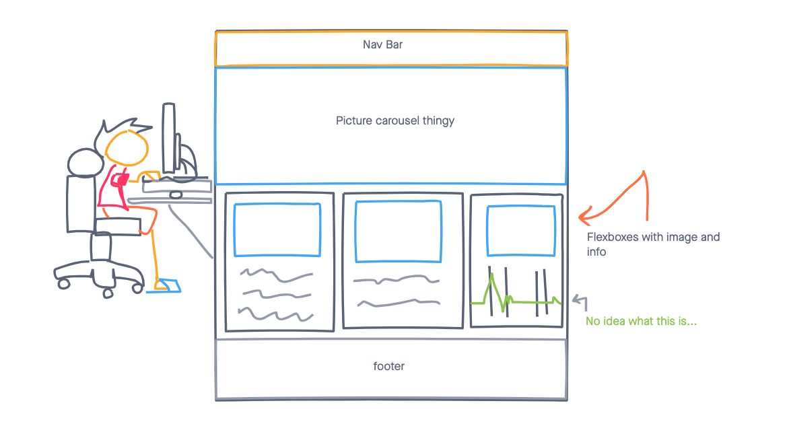

# ME Website
## Day One Of 30 day Web challenge

---------------------------------------------------------------
## Technologies Used
- HTML5
- CSS3
- Javascript
- Font Awesome
- jQuery

&nbsp;

### Wireframe For ME website:

## Completed Static Site

## [Click](https://handwidhtv8.github.io/me-project-day-1/) here to see my *site!*